# Spring-JPA-jQuery-WebApp

Executing instruction:
The app is ready to go immediately after pulling to local machine. All that you need to do is to change the data source to your database in the following file:
https://github.com/manazirahsan1/Spring-JPA-jQuery-WebApp/blob/master/src/main/resources/application.properties
https://github.com/manazirahsan1/Spring-JPA-jQuery-WebApp/watchers

This is a web application developed using Java. Following technologies are used to implement it:
1. Language: Java
2. Framework: Spring
3. Database: MySQL, Spring data JPA
4. Front end technology: jQuery, Twitter Bootstrap
5. Server: Embedded Tomcat server

It has several modules:
1. Total registration management: sign up, email verification, resetting password
2. Profile management: sign in/sign out, secure access of profile
3. Complete CRUD operation with resources: profile and apps
4. Miscellaneous
  a. File upload/download facility
  b. Manual authentication and authorization (i.e., withoug OAuth)
  c. Custom notification at each transaction or failed operation

Cheers.

# Some screencast of the web application:
<h2>Home Page</h2>
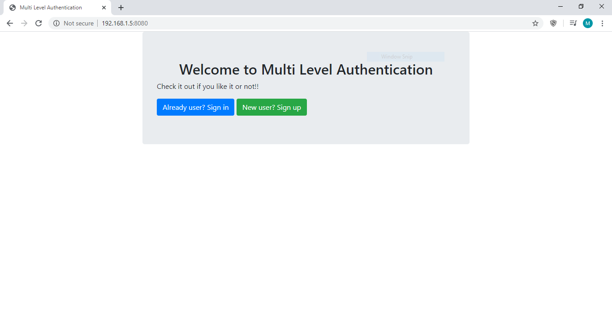

<h2>Registration Error: Invalid Input</h2>
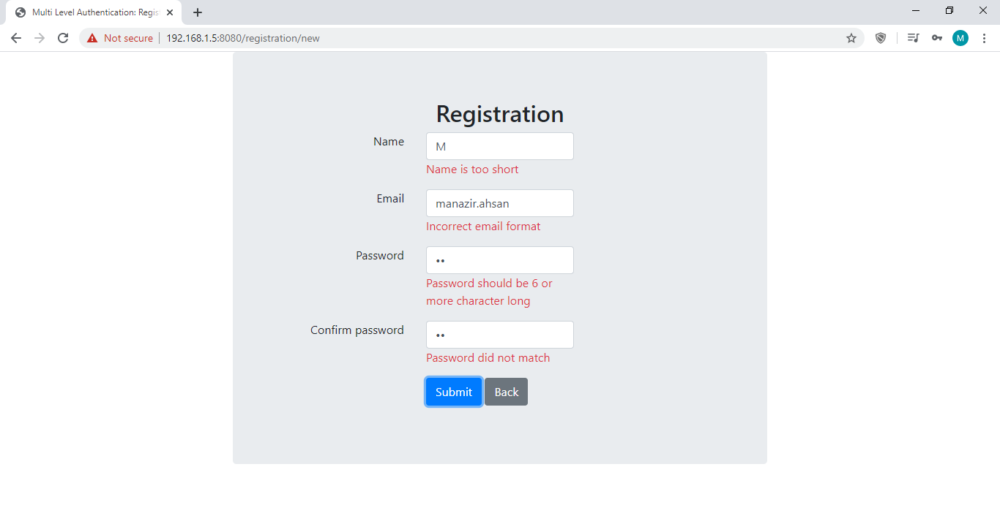
<h2>Registration Error: Email Already Registered</h2>
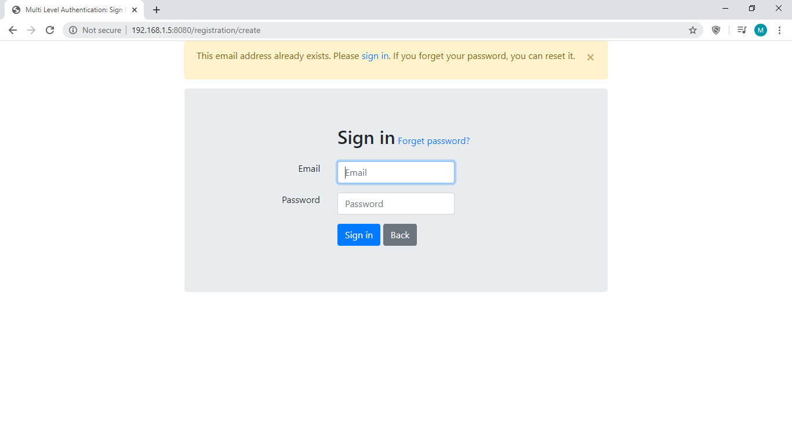

<h2>Reset Password: Enter Email</h2>
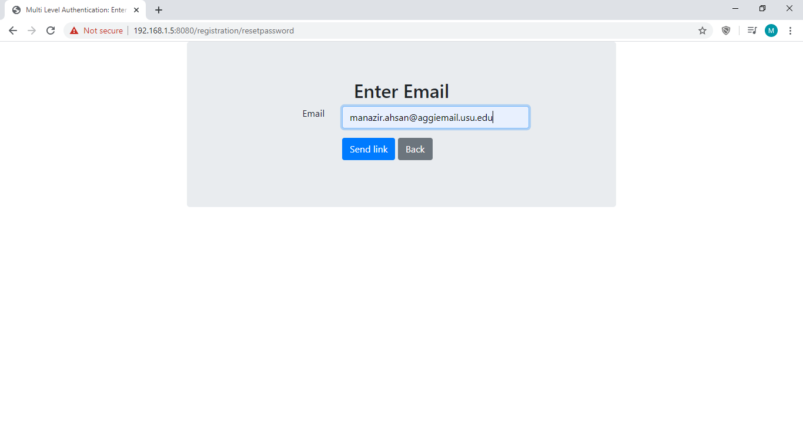
<h2>Reset Password: Email Sent Notification</h2>
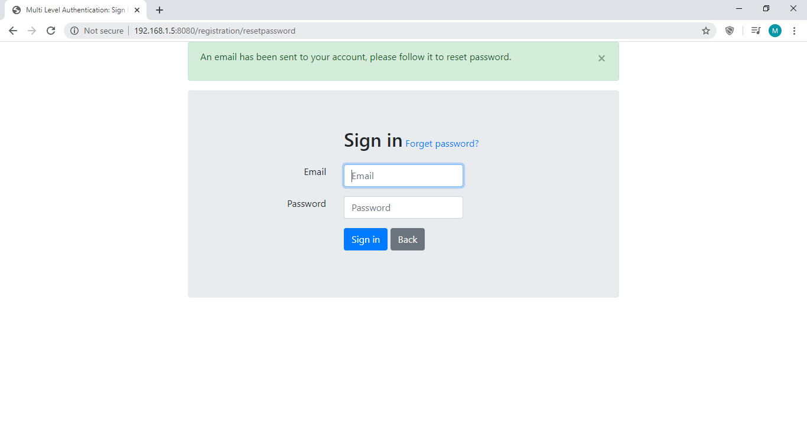

<h2>Login Error: Empty Fields</h2>
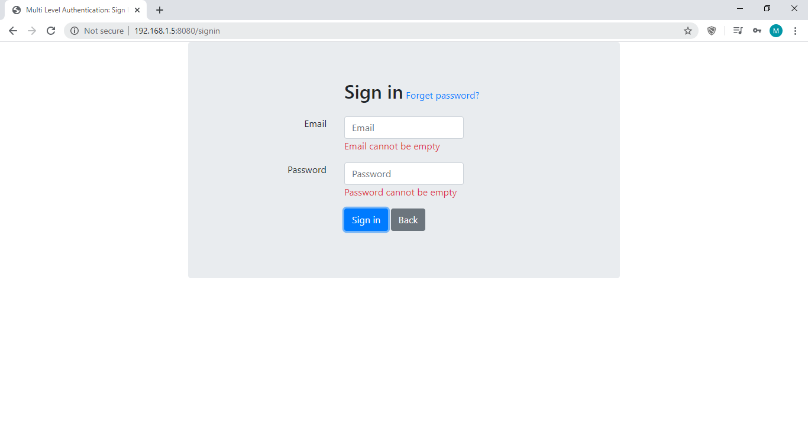
<h2>Login Error: Invalid Input</h2>
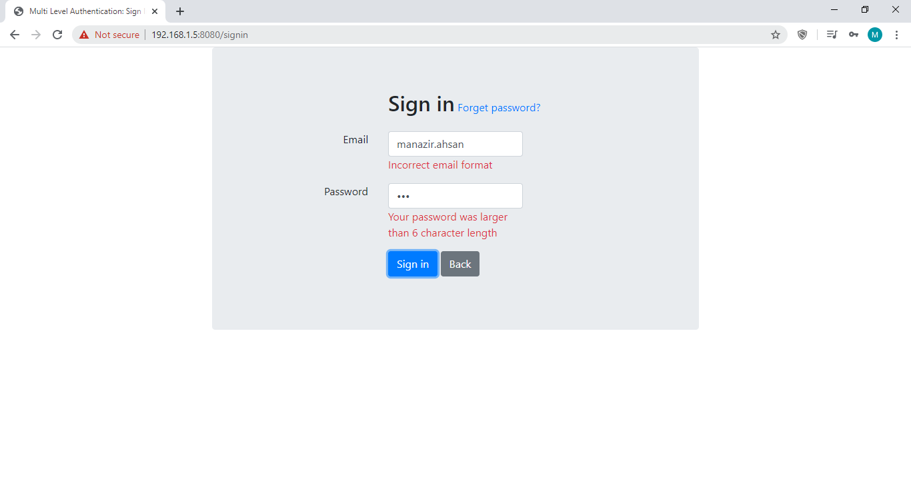
<h2>Login Error: Invalid Username and Password Pair</h2>
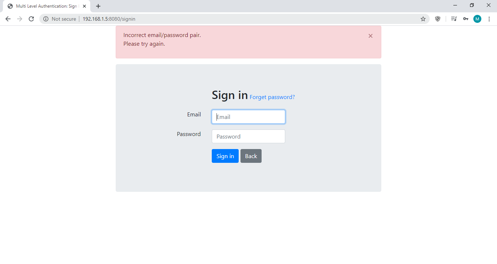

<h2>Loggedin User: All Profiles</h2>
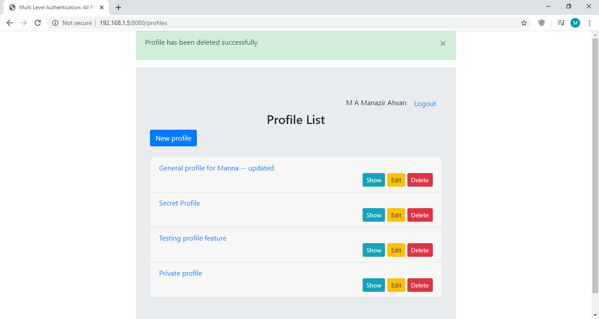
<h2>Loggedin User: New Profile</h2>
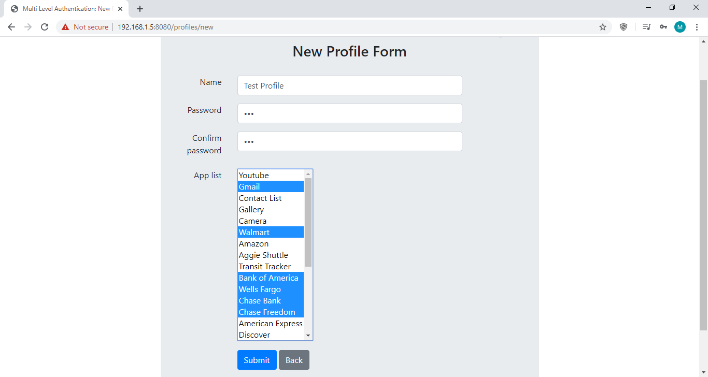
<h2>Loggedin User: Edit Profile</h2>
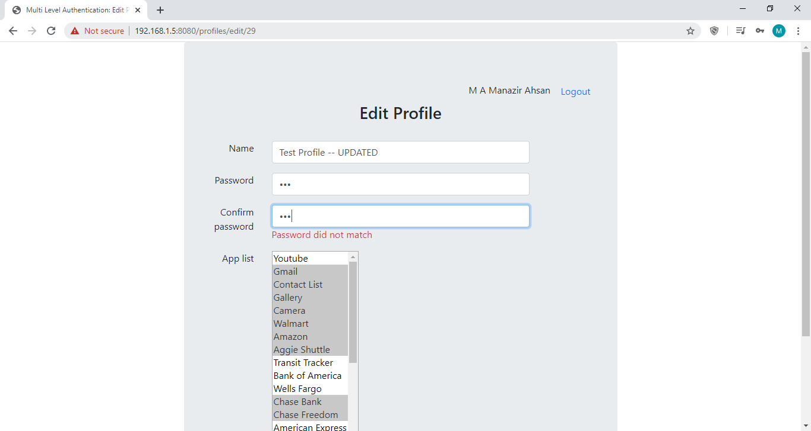
<h2>Loggedin User: Show Profile</h2>
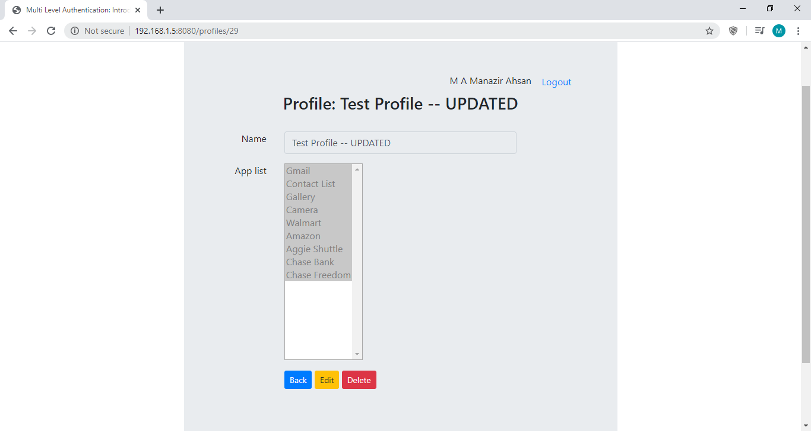
<h2>Loggedin User: Details Profile</h2>
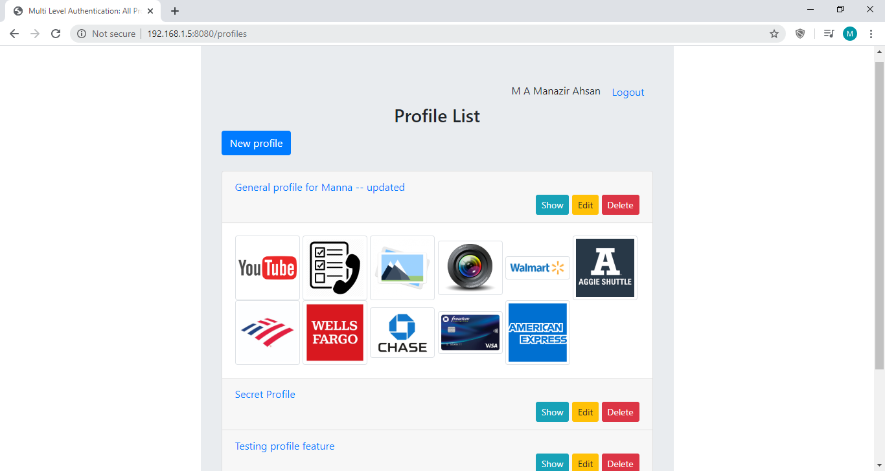
<h2>Loggedin User: Delete Profile</h2>

<h2>Unauthorized Access</h2>
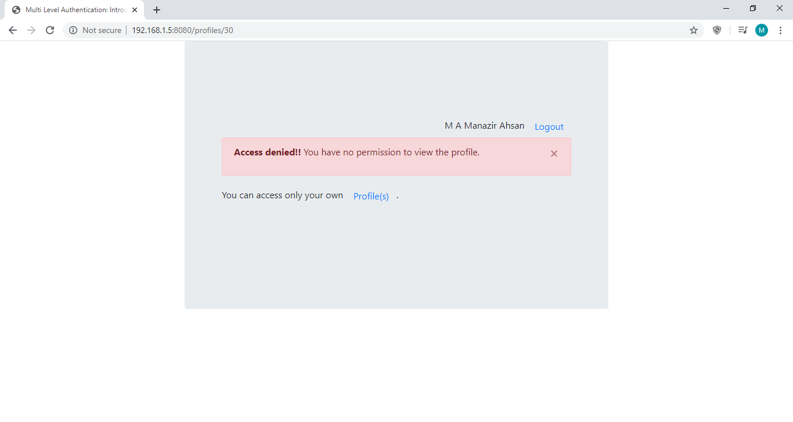

#
<h2>Apps: All Apps</h2>
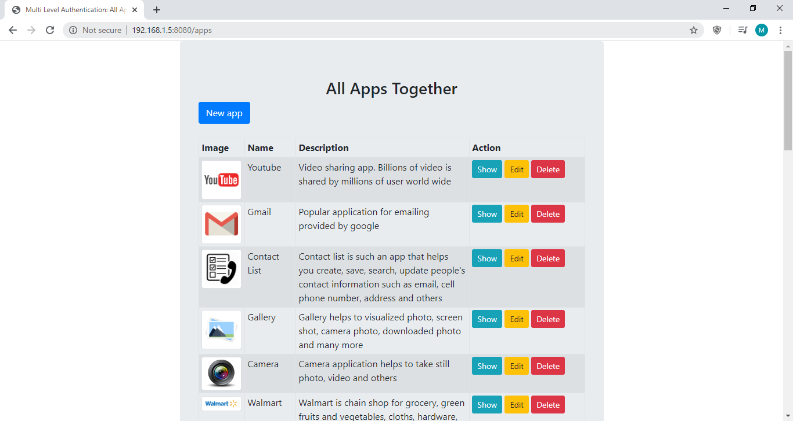
<h2>Apps: New App</h2>
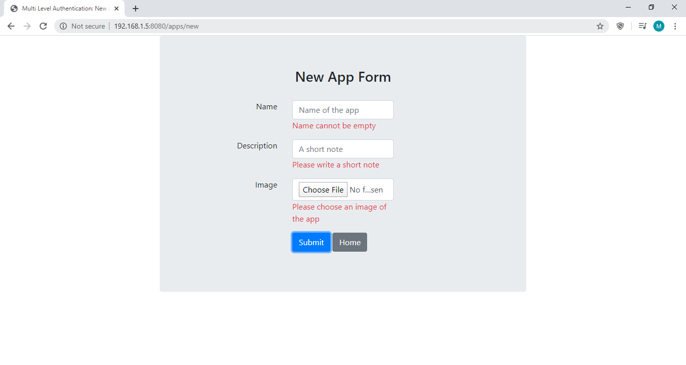
<h2>Apps: Edit App</h2>
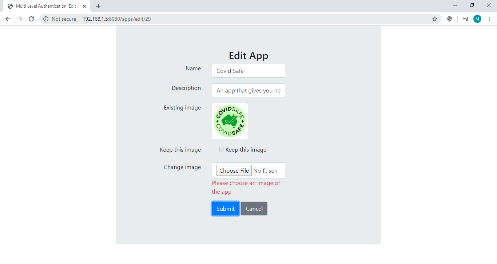
<h2>Apps: Show App</h2>
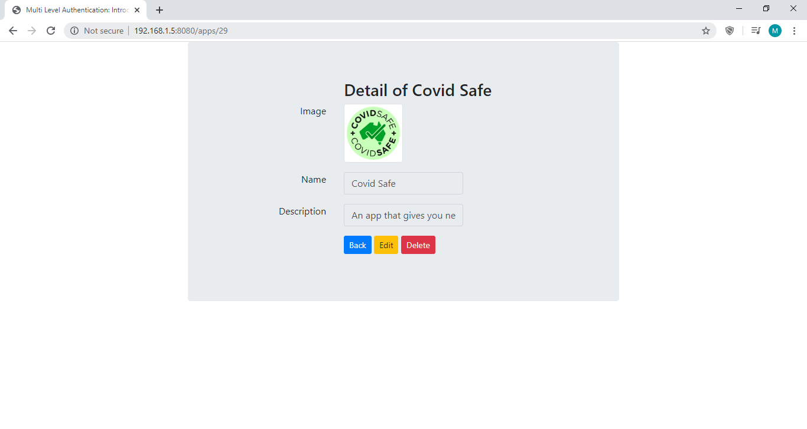
